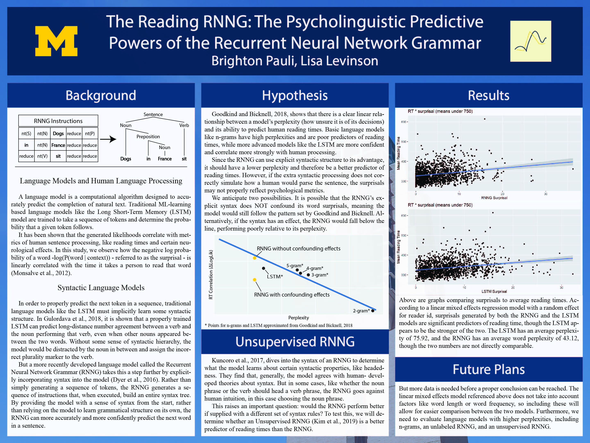

<!-- shrink header after scrolling -->

<!-- links to other sites -->

<table width="100%" table-layout="fixed">
<tr>
<td class="center_element">
    
</td>
<td class="center_element">
    
</td>
<td class="center_element">
    
</td>
<td class="center_element">
    
</td>
</tr>
</table>

---

---

<table width="100%">
<tr>
<td width="50%" class="code_box">
    <textarea id="phrase" rows="15" cols="40" class="code_write"></textarea>
    <!-- <py-inputbox id="phrase"></py-inputbox> -->
</td>
<td class="code_box">
    <code id="display" box-shadow="transparent"></code>
</td>
</tr>
</table>

<button id="convert" pys-onClick="convert">
Convert
</button>

<!-- main pyscript code -->

<py-script>
in_ = Element("phrase")
out = Element("display")

def convert(*args, **kwargs):
    out.write(in_.value)
</py-script>